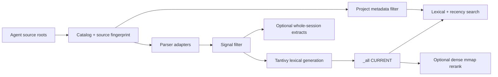

# Architecture

`aicx` is a source-first catalog, extraction, and retrieval system.



## Authority boundaries

- **Live source roots** own session content.
- **Catalog** owns session identity, topical project attribution, canonical
  source path, and live fingerprint.
- **Extract cache** is optional readable duplication, one file per session.
- **CURRENT generation** is a derived, atomically published search view.
- **Legacy archive** is read/recovery-only for old card trees and projection
  stages.

The removed card mill is not an authority boundary and cannot be re-grown by a
production command.

## Main modules

- `src/catalog.rs` — source census and durable session catalog.
- `src/source_path.rs` — canonical allowlisted source resolver.
- `src/source_index.rs` — signal filtering, per-source parse state, and
  incremental generation materialization.
- `src/search_engine.rs` — typed search routing and fallback policy.
- `src/aicx_home.rs` — the only AICX runtime-root resolver/initializer.
- `src/legacy_archive.rs` + `src/legacy_archive/` — residual corpus
  reads, quarantine inspection, and migration recovery.
- `src/extraction/` and `crates/aicx-parser/` — agent discovery and parsing.
- `src/vector_index.rs` and `crates/aicx-retrieve/` — hybrid generation and
  dense mmap support.
- `src/mcp.rs` — CLI-parity MCP tools.
- `src/doctor/` — bounded health plus explicit deep recovery.
- `src/wizard/` — interactive catalog/index/doctor surface.

## Catalog and incremental indexing

`aicx catalog rebuild` walks registered source roots and writes
`~/.aicx/catalog/sessions.jsonl`. Each row includes source length and mtime-ns.

`aicx index` also fingerprints the live source before reuse. A changed existing
session reparses even if the operator did not rebuild the catalog first. Parse
state is persisted in `source_parse_state.v1.json`; a no-op run reuses the
published generation.

Only changed sessions pass through the parser. Filtering retains user messages,
agent replies, plans, and reports while excluding tool calls, internal thought,
system reminders, base64, and image payloads.

## Publication and search

Persistent indexing publishes the global `_all` generation:

```text
$AICX_HOME/indexed/_all/hybrid/
  CURRENT
  generations/<generation>/
    tantivy_lex/
    dense.exact_mmap_v1.bin   # optional
    manifest.json
```

The manifest is written before the pointer flip. Search reads CURRENT and uses
Tantivy plus a recency prior by default. `--deep` adds dense mmap RRF.

Project filters resolve against catalog/index identities and filter `_all`.
Ambiguous exact filters fail closed. Filesystem fallback is legal only for the
typed `IndexNotBuilt` state and is bounded.

## Source security

Source candidates are resolved against approved roots:

- AICX home
- Claude projects
- Codex sessions
- Grok sessions
- Gemini tmp chats
- Vibecrafted runtime runs

The resolver canonicalizes root and candidate, rejects non-files, and proves
containment after symlink resolution before opening. Catalog reads, oversized
Codex reads, fingerprints, and parser reads share that owner.

## Legacy archive

`legacy_archive` retains the minimum read/recovery surface needed for:

- doctor inventory and stage quarantine;
- migration of existing old cards;
- compatibility reads for explicit old chunk references.

It owns no card writer, projection writer, card-mill switch, or CLI ingestion
route. New catalog/index code must not import it merely to resolve AICX home;
that owner is `aicx_home`.

## Runtime interfaces

CLI and MCP share project resolution and typed retrieval outcomes. The wizard's
Rebuild screen shells:

```text
aicx catalog rebuild
aicx index --cache-extracts
```

`index status` is bounded. When no catalog/CURRENT exists it returns `missing`
immediately; an incomplete pending census reports `pending_scan_timeout`.
